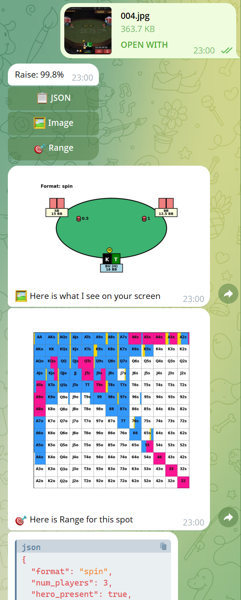
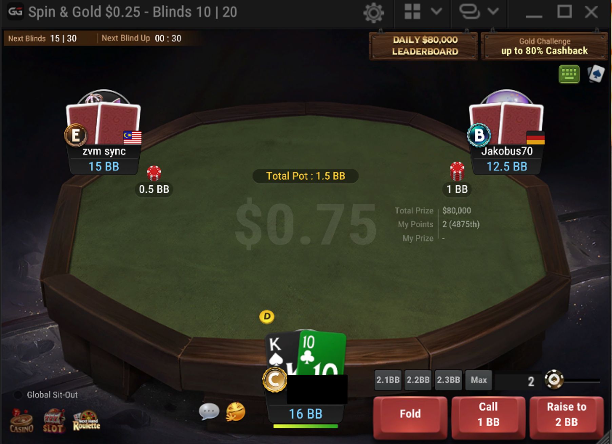
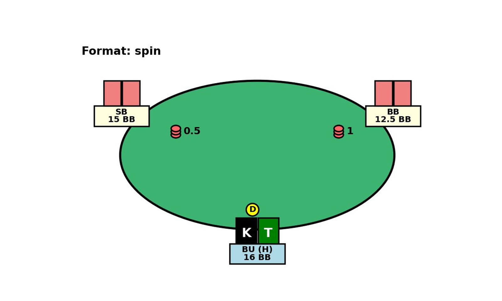
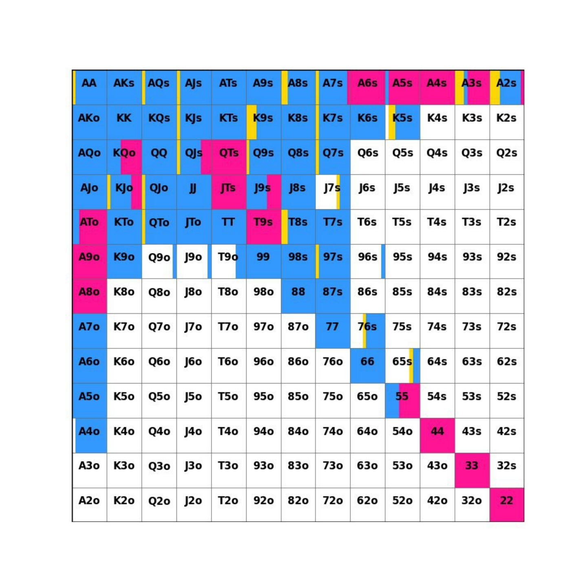

# PokerScreenBot 🎮🤖

An AI-powered tool to analyze poker table screenshots and provide optimal decisions — in under 1 second!

## Demo

<p align="center">
  
</p>

<p align="center">
  
  
</p>

<p align="center">
  
  
</p>

## Project status

Current MVP stage is complete:

✅ The bot accepts a poker table screenshot  
✅ Processes the screen and extracts all relevant elements  
✅ Finds the best action using the internal database and AI logic  
✅ Returns a ready-to-use solution to the user — **in < 1 second**  

✨ It looks like magic in action!  

## Features

✅ Integrated with Telegram — analyze tables via chat  
✅ Three action buttons:
- **`JSON`** — returns the full parsed JSON (useful for developers)
- **`Image`** — returns an annotated visual of the table (great to verify model quality)
- **`Range`** — returns the optimal range for the given situation (highly valuable for professional players)

✅ Fast and accurate detection of:
- Player positions
- Stack sizes
- Current bets
- Hero cards
- Ante, Button position

✅ Fully structured JSON output  
✅ Clean visual mockup of the table  

## Limitations

- Currently the database contains hands only for **Spin & Go** formats — sufficient for testing and early use  
- Expanding the database for more formats is possible, but time-intensive  

## Architecture

- `main.py` → unified entry point  
- `api_app/` → FastAPI REST API  
- `bot_app/` → Telegram bot logic  
- `poker_pipeline/` → AI pipeline core logic  
    - `pipeline.py` → main `process_screen` function  
    - `ocr_utils.py` → number extraction  
    - `card_classification.py` → rank / suit classification  
    - `cards_preprocessing.py` → card image preprocessing  
    - `draw_table.py` → visualization utilities  
    - `models_loader.py` → model paths  

## Models & Data Disclaimer

⚠️ Please note:

- This repository contains only the **infrastructure code** of the PokerScreenBot (pipeline, API, Telegram integration, core logic).
- The **trained models** (`models/` folder) and the **solver database** (`solver_db/` folder) are **not included** in this public repository.
- Without these components, the bot will not function fully out of the box — this is intentional, to protect proprietary data.
- If you wish to adapt or extend this project, you will need to train your own models and prepare your own solver database.

## Quick Start

1️⃣ Clone the repo  

```bash
git clone https://github.com/your_username/PokerScreenBot.git
cd PokerScreenBot
```

2️⃣ Install dependencies:

```bash
pip install -r requirements.txt
```

3️⃣ Run the bot + API:

```bash
python main.py
```

4️⃣ Send a poker table screenshot to the Telegram bot → get structured JSON + annotated image + range solution.

## Models used

- YOLOv8 for table elements detection  
- YOLOv8 for digits recognition  
- ResNet18 / MobileNetV2 for rank / suit / format classifiers  
- Simple OCR CNN for stack / bet amounts  

## Next steps

- Expand the hand history database (MTT / Battle formats)  
- Add vector search with RAG for flexible Q&A and recommendations  
- Build an interactive dashboard  
- Add context-aware strategic suggestions  

## Author

👤 **Vlad Boyar**

- GitHub: [@Vlad-Boyar](https://github.com/Vlad-Boyar)
- LinkedIn: [Vlad Boyarin](https://www.linkedin.com/in/vlad-boyarin)
